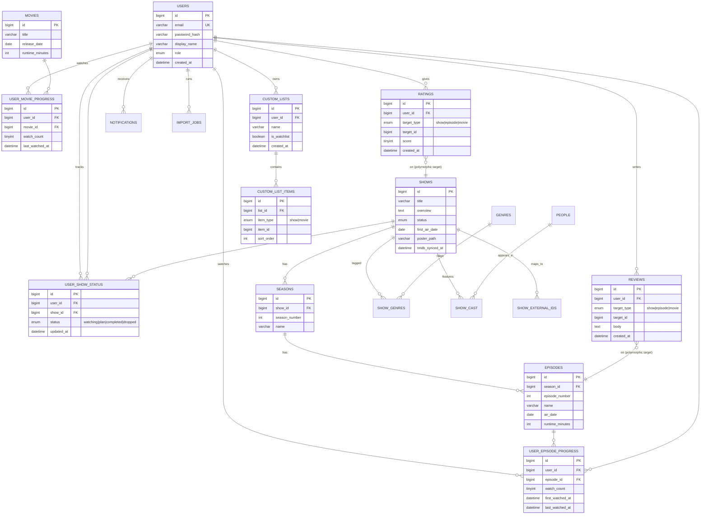

# 3. Database Design (MySQL)

## 3.1 Design principles

- **Third normal form** as the default; denormalize only where a materialized rollup is explicitly justified (statistics — see [07-analytics.md](07-analytics.md)).
- **Every user-owned row carries `user_id`** — enforced at the query layer, indexed, ready for multi-user from day one (see [02-architecture.md](02-architecture.md) §2.4).
- **Catalog data (shows/movies/episodes/people) is shared, not per-user** — one row per show regardless of how many users track it; user-specific state lives in join/junction tables.
- **External IDs live on the catalog rows**, not bolted on later — TMDb is canonical, but TVDB/IMDb/Trakt IDs are first-class columns so no provider is a hard lock-in and TV Time GDPR imports (which reference TVDB IDs) can be matched.
- **Soft state, hard history** — "untracking" a show clears its active status but never deletes historical watch rows; deletion is a separate, explicit, user-initiated action (needed for a trustworthy stats engine and for GDPR-style "download everything" parity).

## 3.2 Entity-relationship diagram (core entities)

## 3.3 Full table catalog

### Identity & access

**`users`**
| Column | Type | Constraints |
|---|---|---|
| id | BIGINT UNSIGNED | PK, AUTO_INCREMENT |
| email | VARCHAR(255) | UNIQUE, NOT NULL |
| password_hash | VARCHAR(255) | NOT NULL (nullable if passkey-only) |
| display_name | VARCHAR(100) | NOT NULL |
| avatar_path | VARCHAR(255) | NULL |
| role | ENUM('admin','member') | NOT NULL DEFAULT 'member' |
| timezone | VARCHAR(64) | NOT NULL DEFAULT 'UTC' |
| created_at | DATETIME | NOT NULL DEFAULT CURRENT_TIMESTAMP |
| deleted_at | DATETIME | NULL — soft delete for account closure |

**`refresh_tokens`**: `id`, `user_id` FK, `token_hash`, `expires_at`, `revoked_at`, `created_at`. Index on `(user_id, expires_at)`.

**`api_keys`** (for future automation/integrations, e.g. a personal script hitting your own API): `id`, `user_id` FK, `key_hash`, `label`, `last_used_at`, `created_at`.

### Catalog (shared, provider-sourced)

**`shows`**: `id`, `title`, `original_title`, `overview` TEXT, `status` ENUM('returning','ended','canceled','in_production'), `first_air_date` DATE NULL, `poster_path`, `backdrop_path`, `network` VARCHAR(150), `tmdb_id` BIGINT UNIQUE, `tmdb_synced_at` DATETIME, `created_at`. Index on `tmdb_id`, fulltext index on `title` for search.

**`show_external_ids`**: `id`, `show_id` FK, `provider` ENUM('tmdb','tvdb','imdb','trakt'), `external_id` VARCHAR(64). UNIQUE `(show_id, provider)` and UNIQUE `(provider, external_id)` — the second uniqueness is what makes import matching reliable.

**`seasons`**: `id`, `show_id` FK, `season_number` INT, `name`, `poster_path`, `air_date` DATE NULL. UNIQUE `(show_id, season_number)`.

**`episodes`**: `id`, `season_id` FK, `episode_number` INT, `name`, `overview` TEXT, `air_date` DATE NULL, `runtime_minutes` INT NULL, `still_path`. UNIQUE `(season_id, episode_number)`. Index on `air_date` (calendar queries).

**`movies`**: `id`, `title`, `overview` TEXT, `release_date` DATE NULL, `runtime_minutes` INT NULL, `poster_path`, `tmdb_id` BIGINT UNIQUE, `tmdb_synced_at`. Fulltext index on `title`.

**`movie_external_ids`**: same shape as `show_external_ids`, scoped to movies.

**`genres`**: `id`, `name` UNIQUE, `tmdb_id` UNIQUE NULL.
**`show_genres`**: `show_id` FK, `genre_id` FK — composite PK.
**`movie_genres`**: `movie_id` FK, `genre_id` FK — composite PK.

**`people`**: `id`, `name`, `profile_path`, `tmdb_id` UNIQUE.
**`show_cast`**: `id`, `show_id` FK, `person_id` FK, `character_name`, `sort_order`.
**`movie_cast`**: `id`, `movie_id` FK, `person_id` FK, `character_name`, `sort_order`.
**`networks`**: `id`, `name` UNIQUE, `logo_path`, `tmdb_id` UNIQUE.

### User tracking state

**`user_show_status`**: `id`, `user_id` FK, `show_id` FK, `status` ENUM('watching','plan_to_watch','completed','dropped'), `is_favorite` BOOLEAN DEFAULT FALSE, `created_at`, `updated_at`. UNIQUE `(user_id, show_id)` — one status row per user per show, updated in place (this is the specific fix for TV Time's duplicate-state sync bugs: one canonical row, server-timestamped).

**`user_episode_progress`**: `id`, `user_id` FK, `episode_id` FK, `watch_count` TINYINT UNSIGNED DEFAULT 0, `first_watched_at` DATETIME NULL, `last_watched_at` DATETIME NULL. UNIQUE `(user_id, episode_id)`. Index `(user_id, last_watched_at)` for "recently watched" and stats queries.

**`user_movie_progress`**: same shape as episode progress, scoped to movies. UNIQUE `(user_id, movie_id)`.

### Ratings, reviews, lists

**`ratings`**: `id`, `user_id` FK, `target_type` ENUM('show','episode','movie'), `target_id` BIGINT, `score` TINYINT (1–10, UI can present as stars/thumbs), `created_at`, `updated_at`. UNIQUE `(user_id, target_type, target_id)`. *(Polymorphic association chosen deliberately over three separate rating tables — ratings never need target-specific columns, and the API/statistics layers already branch on `target_type` everywhere else.)*

**`reviews`**: `id`, `user_id` FK, `target_type` ENUM('show','episode','movie'), `target_id` BIGINT, `body` TEXT, `contains_spoilers` BOOLEAN DEFAULT FALSE, `created_at`, `updated_at`. Index `(user_id, target_type, target_id)`.

**`custom_lists`**: `id`, `user_id` FK, `name` VARCHAR(100), `description` VARCHAR(500) NULL, `is_watchlist` BOOLEAN DEFAULT FALSE (exactly one per user enforced at the application layer), `is_public` BOOLEAN DEFAULT FALSE (reserved for future share-by-link), `created_at`, `updated_at`.

**`custom_list_items`**: `id`, `list_id` FK, `item_type` ENUM('show','movie'), `item_id` BIGINT, `sort_order` INT DEFAULT 0, `added_at`. UNIQUE `(list_id, item_type, item_id)`.

### Notifications & jobs

**`notifications`**: `id`, `user_id` FK, `type` ENUM('episode_aired','show_status_change','import_complete','export_ready'), `payload` JSON, `read_at` DATETIME NULL, `created_at`. Index `(user_id, read_at)`.

**`notification_preferences`**: `id`, `user_id` FK UNIQUE, `email_enabled`, `push_enabled`, `notify_new_episode`, `notify_show_status_change` — all BOOLEAN.

**`import_jobs`**: `id`, `user_id` FK, `source` ENUM('tvtime_gdpr','csv','manual'), `status` ENUM('pending','processing','completed','failed'), `raw_file_path`, `summary` JSON NULL (counts matched/unmatched), `error_log` TEXT NULL, `created_at`, `completed_at`.

**`import_row_matches`**: `id`, `import_job_id` FK, `source_row_ref` VARCHAR(255), `matched_show_id` FK NULL, `matched_episode_id` FK NULL, `match_confidence` ENUM('exact','fuzzy','unmatched'), `resolved_by_user` BOOLEAN DEFAULT FALSE — backs the manual-review step of the import wizard (see [08-migration-strategy.md](08-migration-strategy.md)).

**`export_jobs`**: `id`, `user_id` FK, `status` ENUM('pending','processing','completed','failed'), `file_path` NULL, `created_at`, `completed_at`, `expires_at` (signed download link expiry).

### Statistics (materialized rollups — see analytics doc for computation)

**`user_stats_daily`**: `id`, `user_id` FK, `date` DATE, `episodes_watched` INT, `movies_watched` INT, `minutes_watched` INT. UNIQUE `(user_id, date)` — the atomic rollup everything else (monthly/yearly/streaks) is derived from.

## 3.4 Indexing & constraint summary

- Every FK is indexed (MySQL requires this for InnoDB FK constraints anyway; called out explicitly for `user_id` columns since they're the most common `WHERE` clause in the app).
- Composite uniques (`user_id + show_id`, `user_id + episode_id`, etc.) are the actual mechanism preventing duplicate-state bugs — this is a constraint-level guarantee, not just application logic.
- Fulltext indexes on `shows.title` and `movies.title` back the search endpoint without a separate search service at this scale (see [06-tech-stack-and-integrations.md](06-tech-stack-and-integrations.md) for when that would change).
- All FKs use `ON DELETE CASCADE` for strictly-owned children (e.g., `seasons → episodes`, `custom_lists → custom_list_items`) and `ON DELETE RESTRICT` where a catalog row must not vanish out from under user history (e.g., a `show` can't be deleted while any `user_show_status` references it — catalog rows are pruned by a separate "orphan cleanup" job, not cascaded).
- `deleted_at` soft-delete pattern only on `users` (account closure needs a grace period); all other deletions are hard deletes gated by explicit confirmation in the UI, since watch history tables are the thing users most need to trust as durable.
